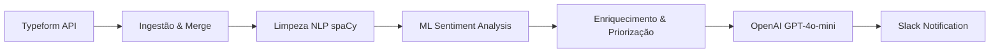

# 📧 AI-Powered Email Triage & Automation Pipeline

[](https://www.python.org/)
[](https://pandas.pydata.org/)
[](https://scikit-learn.org/)
[](https://spacy.io/)
[](https://www.typeform.com/)
[](https://openai.com/)
[](https://slack.com/)
[](https://github.com/astral-sh/uv)
[](https://github.com/features/actions)
[](https://code.visualstudio.com/)

Uma solução completa de Engenharia de Dados e NLP para automação de atendimento ao cliente. Este pipeline transforma mensagens brutas recebidas via Typeform em ações estruturadas, classificando sentimentos, priorizando casos críticos e gerando rascunhos de resposta inteligentes via LLM, com entrega final integrada ao Slack.

---

## 🎯 Escopo do Projeto

### O Problema
Empresas com alto volume de interações enfrentam gargalos no atendimento inicial. Mensagens críticas (ameaças de cancelamento, riscos jurídicos ou reclamações de alto valor) muitas vezes ficam perdidas em caixas de entrada genéricas, resultando em:
- **Churn elevado** por demora na resposta de clientes insatisfeitos.
- **Riscos operacionais** ao não identificar menções ao Procon ou ações judiciais em tempo real.
- **Inconsistência** nas respostas enviadas por diferentes atendentes.

### A Solução
Desenvolvi um pipeline automatizado que atua como uma **camada de inteligência prévia** ao atendimento humano. O sistema utiliza técnicas avançadas de Processamento de Linguagem Natural (NLP) e Modelos de Linguagem de Larga Escala (LLMs) para:
1. **Ingestão Inteligente:** Coleta incremental de dados via API, garantindo que nenhuma mensagem seja processada duas vezes.
2. **Classificação de Sentimento:** Um modelo de Machine Learning (TF-IDF + Logistic Regression) treinado para identificar tons positivos, neutros e negativos.
3. **Análise de Prioridade Baseada em Regras e Entidades:** Extração de valores monetários e prazos para elevar a prioridade de tickets de alto impacto.
4. **Respostas Contextuais:** Geração de rascunhos personalizados que respeitam o tom de voz da empresa e as diretrizes da LGPD.
5. **Observabilidade em Tempo Real:** Notificações estruturadas no Slack para que a equipe de CS (Customer Success) possa agir imediatamente nos casos de "Alta Prioridade".

---

## 🏗️ Arquitetura do Sistema



---

## 🛠️ Stack Tecnológica

| Camada | Ferramentas |
|---|---|
| **Linguagem & Gestão** | Python 3.11+, [uv](https://github.com/astral-sh/uv) |
| **NLP & Machine Learning** | scikit-learn, spaCy (`pt_core_news_sm`), pandas |
| **LLM & Generative AI** | OpenAI API (GPT-4o-mini) |
| **Integrações** | Typeform API, Slack SDK |
| **Automação (M LOps)** | GitHub Actions |

---

## 🚀 Configuração do Ambiente

Este projeto utiliza o [uv](https://github.com/astral-sh/uv), um gerenciador de pacotes Python extremamente rápido, para garantir um ambiente determinístico e eficiente.

### 1. Requisitos Prévios
- Python 3.11 ou superior.
- Instale o `uv`:
  ```bash
  curl -LsSf https://astral.sh/uv/install.sh | sh
  ```

### 2. Instalação e Setup
Clone o repositório e configure o ambiente com um único comando:
```bash
# Cria o ambiente virtual e instala dependências
uv sync

# Ativa o ambiente
source .venv/bin/activate  # Linux/macOS
# ou
.venv\Scripts\activate     # Windows

# Baixa o modelo de linguagem do spaCy
uv run python -m spacy download pt_core_news_sm
```

### 3. Variáveis de Ambiente
Crie um arquivo `.env` na raiz do projeto:
```env
# Typeform Config
TYPEFORM_TOKEN=tfp_...
TYPEFORM_FORM_ID=...

# OpenAI Config
OPENAI_API_KEY=sk-...
OPENAI_MODEL=gpt-4o-mini

# Slack Config
SLACK_BOT_TOKEN=xoxb-...
SLACK_CHANNEL_ID=...
```

---

## 📈 Pipeline de Execução

Você pode executar o pipeline completo sequencialmente utilizando o `uv run`:

```bash
# Ingestão e Preparação
python src/form_ingest.py --reset-cursor # resetando a ingestão de dados
python src/merge_messages.py

# Processamento NLP e ML
python src/clean_and_annotate.py
python src/train_sentiment.py --data data/unified_clean.csv --out models/sentiment.joblib
python src/predict.py

# Pós-processamento e Entrega
python src/postprocessing.py
python src/llm_generate_replies.py
python src/send_to_slack_bot.py --limit 10 # inserindo dados com limite de 10
```

---

## ⚙️ CI/CD & Automação

O projeto conta com um workflow do **GitHub Actions** (`daily_pipeline.yml`) que orquestra a execução completa diariamente. Ele garante que:
- O ambiente seja reconstruído de forma limpa.
- O modelo de sentimento seja revalidado.
- As mensagens do dia sejam processadas e enviadas ao Slack automaticamente às 05:00 BRT.

---

## 🧠 Detalhes Técnicos de NLP

- **Pré-processamento:** Limpeza profunda envolvendo normalização Unicode, remoção de stop-words customizadas e lematização para reduzir a dimensionalidade do vocabulário.
- **Modelo de Sentimento:** Pipeline `TfidfVectorizer` (unigramas e bigramas) com `LogisticRegression` balanceada para lidar com datasets de feedback naturalmente desbalanceados.
- **Extração de Entidades (NER):** Utilização do spaCy para identificar valores monetários e datas, permitindo automação de regras de negócio complexas (ex: priorizar reclamações > R$ 1.000).

---

## 👨‍💻 Autor

**Fernando Galvão**

Engenheiro de Dados e Aprendizado de Máquina | Especialista em Automação e IA
Data Engineer and Machine Learning | Automation and AI Specialist

---
*Este projeto foi desenvolvido com foco em escalabilidade, manutenibilidade e impacto direto no ROI de operações de atendimento ao cliente.*
